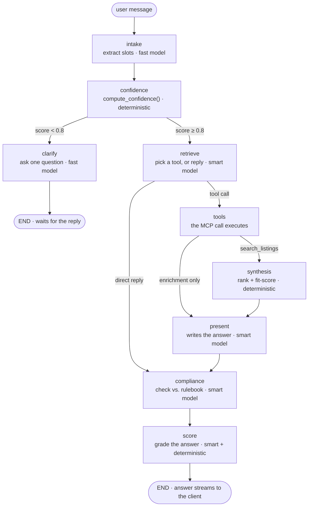

# Home Compass

**An AI real-estate agent that tells you how sure it is — before it tells you what to buy.**

Most AI chat tools answer immediately, whether or not they actually have enough
information to. Home Compass is built around the opposite bet: it won't
recommend a home until it understands what you're looking for, it won't state
a fact it can't source, and every answer is checked against a compliance
rulebook before you ever see it.

## What it actually does

You chat with it the way you'd talk to a real agent — no forms, no filters,
just describe what you want. Behind the scenes:

- It tracks a **live confidence score** (budget, location, beds/baths,
  must-haves, timeline) and only searches once that score clears a threshold.
  Below it, it asks one targeted follow-up instead of guessing.
- Search results come back as ranked cards, each with a **fit score** — how
  well that specific listing matches what you asked for — not just a raw
  list.
- Ask a follow-up about a listing's crime rate, demographics, or the local
  market, and it fetches that specific data on demand and cites its source.
  Nothing gets enriched unless you actually ask for it.
- Every finished answer is checked against an ingested rulebook (modeled on
  fair-housing regulations) before it ships, and can be revised in place if
  it violates a rule.
- Every answer is also graded for how well it's grounded in the data it
  actually had — a second, independent signal from the confidence score.

## How it works

A message flows through a small state machine, one step at a time:



Two things worth noticing:

1. **The confidence score is a plain deterministic function**, not a model
   call — it has to be, since it's shown to the user as the compass reading
   and needs to be reproducible.
2. **The chat model is split into two roles by task**, not one model for
   everything: a small, fast model handles the cheap, simple steps (pulling
   structured details out of what you said, asking a follow-up question),
   and a stronger model is reserved for everywhere a wrong call is actually
   expensive — deciding which tool to call, writing the final answer, the
   compliance verdict, and grading the answer.

## Under the hood

| Piece | What it is |
|---|---|
| `api/` | FastAPI + LangGraph — the agent itself, streamed to the browser over SSE |
| `mcp-property/` | MCP tool server — hybrid SQL + pgvector listing search |
| `mcp-enrich/` | MCP tool server — Census demographics + FBI crime data, cached in Postgres |
| `mcp-market/` | MCP tool server — batch market data, with a live web-search fallback |
| `db/` | The Postgres + pgvector schema (SQLAlchemy models) |
| `compliance/` | The RAG guardrail — ingests a rules PDF, embeds it, serves it to the compliance check |
| `web/` | The Next.js chat UI — streaming responses, the confidence gauge, sourced listing cards |
| `evals/` | A behavioral regression suite for the agent's actual behavior, not just the code |
| `ingest-worker/` | Seeds the sample listings dataset |

The three MCP tool servers aren't imported functions — they're separate
processes, spawned over stdio by `api/`, the same way a real third-party tool
integration would work.

## Tech stack

Python · FastAPI · LangGraph · LangChain · MCP · PostgreSQL + pgvector ·
Ollama · Next.js · React · TypeScript · Tailwind · Docker

## Getting started

You need two things running locally no matter which path you take:

- **[Docker Desktop](https://www.docker.com/products/docker-desktop)** — for Postgres (and everything else, if you take the Docker path)
- **[Ollama](https://ollama.com)** — embeddings always run locally, even in the Docker path. Install it, then:
  ```bash
  ollama pull nomic-embed-text
  ```
  Leave it running.

### 1. Configure

```bash
cp .env.example .env
cp web/.env.local.example web/.env.local
```

Open `.env` and paste in a free **Groq** API key — no credit card, get one at
[console.groq.com](https://console.groq.com). It's the only key you strictly
need; everything else in `.env` already has a working default or is
optional (neighborhood data, live tracing, the compliance guardrail).

### 2. Run it — Docker (recommended)

```bash
docker compose up -d postgres
docker compose run --rm tools python db/create_tables.py
docker compose run --rm tools python ingest-worker/seed_kaggle.py --limit 5000
docker compose up --build
```

That last command builds and starts the API, the frontend, and a database
browser together. Once it's up:

- **http://localhost:3000** — the app
- **http://localhost:8081** — Adminer, to browse the database directly

### 2 (alternative). Run it without Docker

Postgres still runs in a container either way; everything else runs
directly on your machine.

```bash
docker compose up -d postgres
python db/create_tables.py
python ingest-worker/seed_kaggle.py --limit 5000

cd api
pip install -r requirements.txt -r ../requirements.txt \
  -r ../mcp-property/requirements.txt -r ../mcp-enrich/requirements.txt -r ../mcp-market/requirements.txt
uvicorn main:app --reload --port 8080     # terminal 1
```

```bash
cd web
npm install
npm run dev                                # terminal 2
```

Open **http://localhost:3000**.

> `mcp-property`, `mcp-enrich`, and `mcp-market` are spawned automatically as
> local subprocesses the moment the backend starts — you never run them
> yourself.

### 3. Try it

- Say something vague — *"I'm looking for a place"* — you should get back
  exactly one targeted question, with a low compass reading.
- Give full criteria — *"3 bed house in Newark NJ, 300–500k, quiet street,
  moving in 3 months"* — you should get ranked listing cards and a compass
  near 100%.
- Ask a follow-up about one of the results — *"what's the crime rate
  there?"* — watch it fetch and cite that specific data, without re-running
  the search.

### Optional: turn on the compliance guardrail

Without any setup, the app runs fine with the guardrail simply **off** —
nothing breaks, it just isn't checking answers against a rulebook yet. To
turn it on:

```bash
python compliance/generate_rules_pdf.py
```

Upload the resulting PDF to your Google Drive, do the one-time OAuth setup
described in [`compliance/README.md`](./compliance/README.md), then:

```bash
python compliance/ingest_rules.py
```

Restart the backend and look for `[compliance] guardrail ON` in the startup
log.

## Running the tests

There's no separate unit-test suite — the real risk in an LLM agent is a
prompt or a graph change silently altering *behavior*, so that's what gets
tested directly:

```bash
python evals/run.py --suite confidence     # deterministic, no API key needed
python evals/run.py --suite intake         # structured extraction
python evals/run.py --suite routing        # tool-choice accuracy
python evals/run.py --suite groundedness   # LLM-as-judge: does it invent facts?
python evals/run.py --suite compliance     # does the guardrail catch real violations?
python evals/run.py --suite retrieval      # does it pull the right rule for the question?
python evals/run.py --suite all --runs 3   # everything, replayed 3× to catch flakiness
```

Exit code is `0` only if every case passes.

## Documentation

| Doc | What's in it |
|---|---|
| [`CODE_TOUR.md`](./CODE_TOUR.md) | A guided, in-order walk through the entire codebase |
| [`GRAPH_REFERENCE.md`](./GRAPH_REFERENCE.md) | Every agent node explained in full detail |
| [`DOCKER.md`](./DOCKER.md) | The full Docker setup, ports, and troubleshooting |
| [`evals/README.md`](./evals/README.md) | How the eval suite works and how to grow it |
| [`compliance/README.md`](./compliance/README.md) | The RAG guardrail, in depth, plus prompts to try and break it |

## A note on the data

This is a learning project. The listings come from a public sample dataset,
not a live MLS feed, and the compliance rulebook is a fictional document
built to mirror real fair-housing themes for testing — it says so on its own
cover page. The mechanism around them — the confidence gate, the sourced
retrieval, the guardrail — is real and runs end to end.
